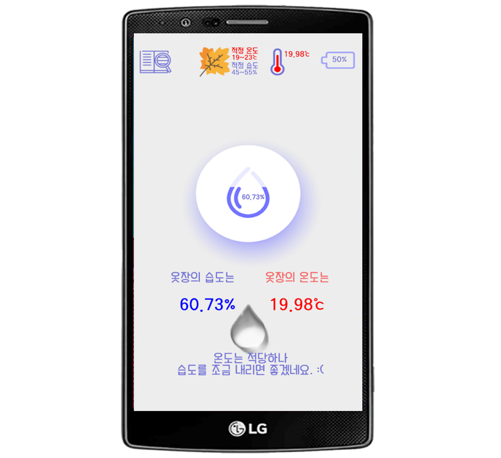
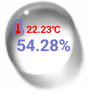

# LG 스마트 씽큐 블루투스 센서를 활용한 온습도 관리 안드로이드 앱
* LG 스마트 씽큐 센서를 옷장안에 부착 후 블루투스로 해당 앱과 연동하여 옷장 안의 온도와 습도를 실시간으로 받아볼 수 있습니다. 

## LG 스마트 씽큐 센서 앱 바로가기
[LG 스마트 씽큐 센서 옷장 온습도관리](https://play.google.com/store/apps/details?id=com.inseop.lg_app)

## 개발환경
* Python 3.5.3
* Android
* 라즈베리파이3

## LG 스마트 씽큐 센서
* 모델명 : AIHC61
* [제품 상세 설명](https://www.lge.co.kr/lgekor/product/accessory/smart-life/productDetail.do?catId=8220&prdId=EPRD.301654)
* LG 스마트 씽큐 센서 소개 영상

[](https://youtu.be/XsV0OR0_UCwt=0s)

## 1. LG 스마트 씽큐 센서 -> 라즈베리파이 서버
* 라즈베리파이 서버에서 센서의 블루투스 데이터(온도, 습도, 배터리)를 받아옵니다.

1. uuid를 통해 service의 characteristic을 가져옵니다.
```
#UUID 가져온다.
washer_service_uuid = UUID("6e400001-b5a3-f393-e0a9-e50e24dcca9e")
battery_service_uuid = UUID("180F")

#washer service Characteristics의 센서에서 전송하는 정보이며 Access Permisson은 Notify 
washerTX_char_uuid = UUID("6e400003-b5a3-f393-e0a9-e50e24dcca9e") #온습도
battery_level_uuid = UUID("00002a19-0000-1000-8000-00805f9b34fb") #배터리

#WasherService, BatteryService를 가져온다.
WasherService=p.getServiceByUUID(washer_service_uuid)
BatteryService =p.getServiceByUUID(battery_service_uuid)

#TX의 Characteristics를 가져온다.
WasherTX_C = WasherService.getCharacteristics(washerTX_char_uuid)[0]
#battey의 Characteristics를 가져온다.
Battery_C = BatteryService.getCharacteristics(battery_level_uuid)[0]
```
2. notification을 활성화 시킵니다.
```
p = Peripheral("c7:74:31:9A:F8:D1","random")
p.setDelegate( MyDelegate(p) )

class MyDelegate(DefaultDelegate):
     #Constructor
    def __init__(self, params):
        DefaultDelegate.__init__(self)
      
     #notification이 활성화되면 불리는 함수
    def handleNotification(self, cHandle, data):
         global humidity,battery,temperature
        
         #print ("Notification Handle: 0x" + format(cHandle,'02X') + " Value: "+ format(data[0]))
         if data[0]==107:
             humidity = format( ( (data[4]<<8) | (data[3]&0xFF) ) / 100 )
             temperature= format( ( (data[2]<<8) | (data[1]&0xFF) ) /100)
             
         else:
             battery  = format(data[0])

def enableNotify(handler):
    p.writeCharacteristic(handler, struct.pack('<bb', 0x01, 0x00) ,False)
    
def disableNotify(handler):
    p.writeCharacteristic(handler, struct.pack('<bb', 0x00, 0x00) ,False)    
```
3. 온도 데이터를 가져옵니다.
```
def Temperature():
    global temperature
    enableNotify(0x13)
    while True:
        if  p.waitForNotifications(1.0):
            # handleNotification() 함수가 불린다.
            disableNotify(0x13)
            return temperature
```
4. 데이터그램소켓 통신으로 안드로이드앱의 요청을 대기합니다.
```
def server():
    
    global battery,humidity,temperature
    #기본포트로설정
    port = ECHO_PORT
    # 소켓 생성 (UDP = SOCK_DGRAM, TCP = SOCK_STREAM)
    s = socket(AF_INET, SOCK_DGRAM)
    #포트설정
    s.bind(('',port))
    
    #쓰레드 동작 : 블루투스의 데이터를 지속적으로 받아옵니다.
    t = threading.Thread(target=notify_thread)
    t.start()

    while True:
        # 클라이언트로 메시지가 도착하면 다음 줄로 넘어가고
        # 그렇지 않다면 대기(Blocking)
        temp, addr = s.recvfrom(BUFSIZE)
        
        Join_String = humidity +":"+ battery +":" +str(temperature)
        Join_as_bytes = str.encode(Join_String)
        s.sendto(Join_as_bytes,addr)
```
## 2. 라즈베리파이 서버 -> 안드로이드 앱
* 안드로이드 앱에서 라즈베리파이 서버에 데이터를 5초마다 요청하여 받아옵니다.
```
    class SendData extends Thread{
        public void run(){
            try{
                while(true) {
                    //UDP 통신용 소켓 생성
                    DatagramSocket socket = new DatagramSocket();

                    //서버 주소 변수
                    InetAddress serverAddr = InetAddress.getByName(sIP);

                    //보낼 데이터 생성
                    byte[] buf = ("send me data please ").getBytes();

                    //패킷으로 변경
                    DatagramPacket packet = new DatagramPacket(buf, buf.length, serverAddr, sPORT);

                    //패킷 전송!
                    socket.send(packet);
                    //데이터 수신 대기
                    socket.receive(packet);
                    //데이터 수신되었다면 문자열로 변환
                    msg2 = new String(packet.getData()); //습도

                    separate_msg2 = msg2.split(":");
                    msg2 = separate_msg2[0];
                    battery2 = separate_msg2[1];
                    temperature2 = separate_msg2[2];


                    if(!battery2.equals("loading") &&battery2.length()>2){
                        separate_battery2 = battery2.split("d");
                        battery2 = separate_battery2[0].replaceAll("\\s+","");
                    }
                    String temp="";
                    String temp2= separate_msg2[2].replaceAll("\\s+","");

                    if(temp2.length()>5) {
                        for (int i = 0; i < temp2.length(); i++) {
                            if (Character.isLetter((temp2.charAt(i)))) {
                                for (int j = 0; j < i; j++) {
                                    temp += temp2.charAt(j);
                                }
                                break;
                            }
                        }
                        temperature2=temp;
                    }
                    else {
                        temperature2 = temp2;
                    }
                    Thread.sleep(5000); // 1/1000단위 1초 == 1000, 1분 == 60000
                }
            }catch (Exception e){
                Log.v("tag :","오류");
            }
        }
    }

```

## 실행 결과



## LG 앱 데모영상

[](https://youtu.be/d4JpNJlxt-g=0s)
